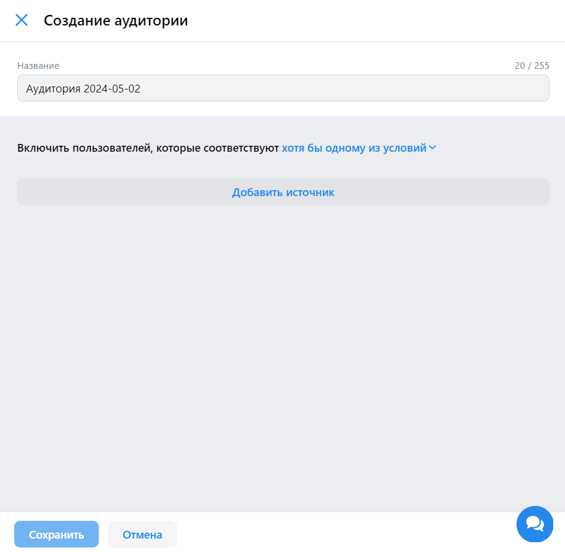
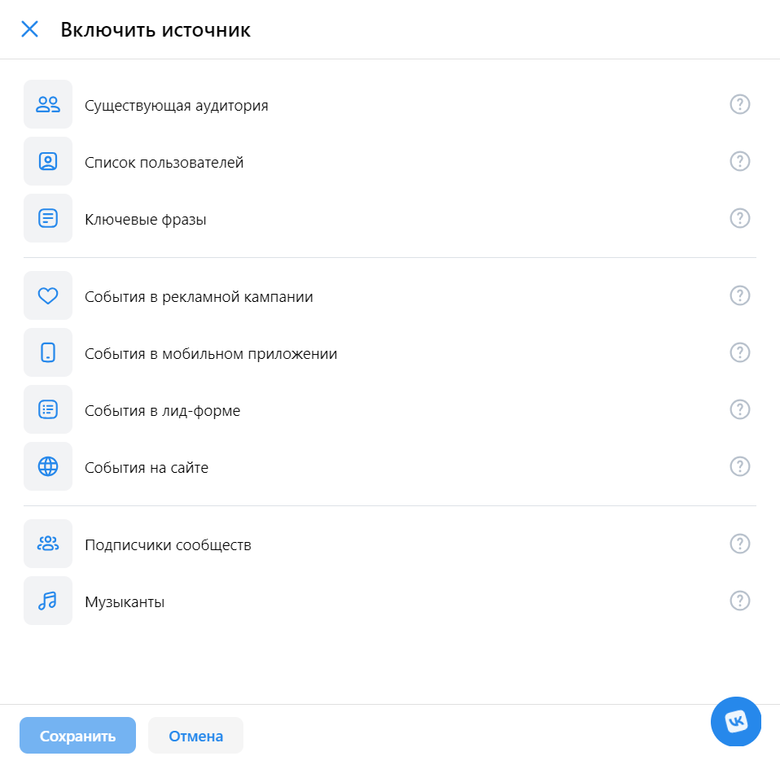
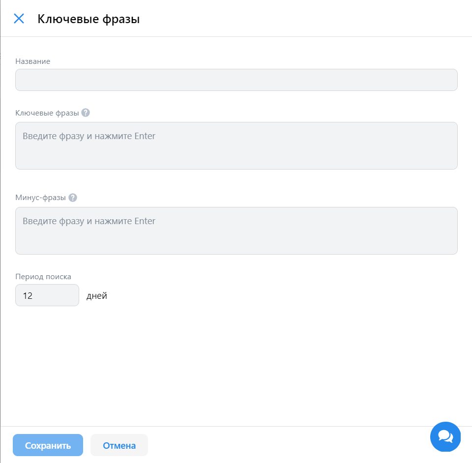
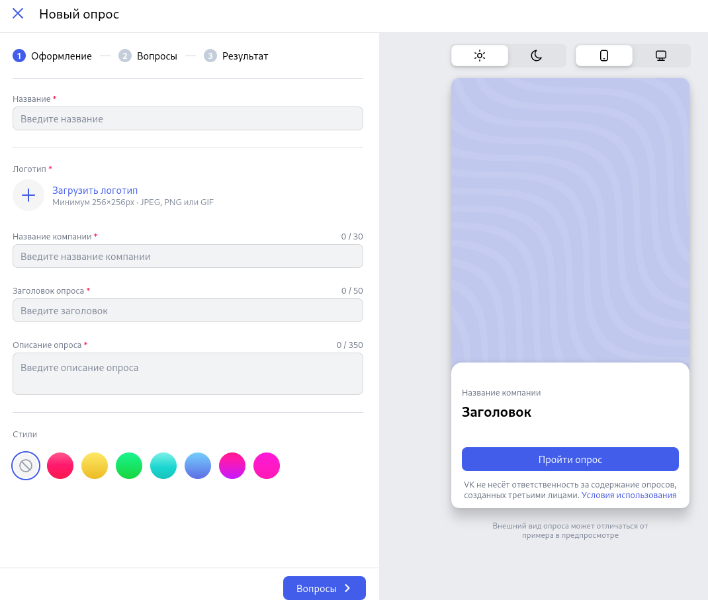
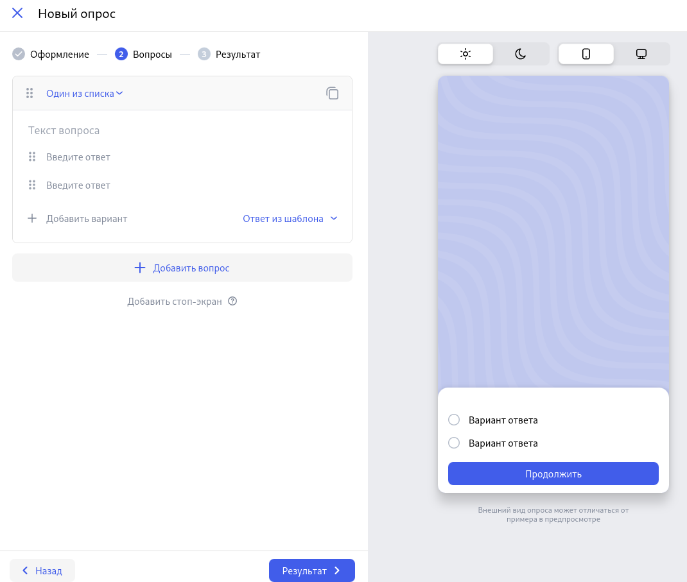
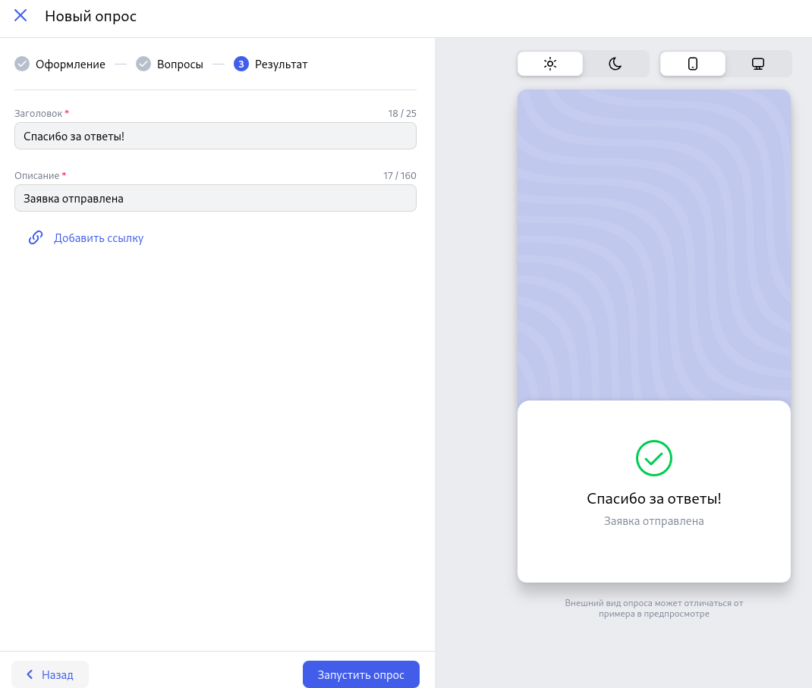

## Вкладка "Аудитории"
* При нажатии на вкладку "Аудитории" открывается [страница аудиторий](https://ads.vk.com/hq/audience)
* При нажатии на кнопку "Создать аудиторию" справа появляется боковое меню "Создание аудитории"

* При нажатии на крестик форма создания аудитории закрывается, возвращаемся на страницу аудиторий

* При нажатии на кнопку "Отмена" форма создания аудитории закрывается, возвращаемся на страницу аудиторий 

* При нажатии на кнопку "Добавить источник" к боковому меню добавляется окно "Включить источник"

* При нажатии на вкладку "Ключевые фразы" окно "Включить источник" заменяется на окно "Ключевые фразы" с инпутами "Название", "Ключевые фразы", "Минус фразы", "Период поиска"

* Кнопка "Сохранить" не активна если не заполнены текстовые поля "Ключевые фразы" или "Минус фразы"
* При заполнении хотя бы одного из полей "Ключевые фразы" или "Минус-фразы" и нажатии кнопки сохранить, окно закрвывается и в списе аудиторий отображается аудитория с заголовком "Ключевые фразы" и заполнеными полями
* При вводе в инпут "Период поиска" число меньше или равное 0, то через секунду оно автоматически заменится на 1
* При нажатии на кнопку "Отмена" окно закрывается

## Настройки

Лид-формы. Настройки. При нажатии на чекбокс "Уведомлять о новых заявках по email" появится поле "Email-адреса"

Лид-формы. Настройки. При введении email-адреса, не соответствующему формату корректного email-адреса, появится сообщение "Неверный email"

Лид-формы. Настройки. При нажатии на чекбокс "Обязательные вопросы" появится поп-ап "Активировать обязательное заполнение вопросов?"

Лид-формы. Настройки. При пустом поле "ФИО" появится подпись-предупреждение "Обязательное поле"

Лид-формы. Настройки. При пустом поле "Адрес регистрации" появится подпись-предупреждение "Обязательное поле"

Лид-формы. Настройки. При нажатии на "Сохранить" (при наличии введённых обязательных полей), лид-форма сохранится на странице

# Настройки

> Ссылка на страницу настроек: https://ads.vk.com/hq/settings

## Главная

Настройки. Главная. При нажатии на раздел "Общие" произойдет переход на страницу с настройками аккаунта (https://ads.vk.com/hq/settings)

Настройки. Главная. При нажатии на раздел "Уведомления" произойдет переход на страницу с уведомлениями (https://ads.vk.com/hq/settings/notifications)

Настройки. Главная. При нажатии на раздел "Права доступа" произойдет переход на страницу с подключением доступа (https://ads.vk.com/hq/settings/access)

Настройки. Главная. При нажатии на раздел "История изменений" произойдет переход на страницу с историей изменений в кабинете. (https://ads.vk.com/hq/settings/logs)

## Общие

### Контакты

Настройки. Общие. Контакты. При вводе телефона не в формате номера телефона, появится ошибка "Некорректный номер телефона"

Настройки. Общие. Контакты. При нажатии на "Добавить email" появится поле ввода

Настройки. Общие. Контакты. При нажатии на крестик около поля ввода email'a поле исчезнет

### Реквизиты

Настройки. Общие. Реквизиты. Если оставить поле ФИО пустым, появится ошибка "Обязательное поле"

Настройки. Общие. Реквизиты. При невведённом ИНН, появится ошибка "Длина ИНН должна быть 12 символов"

Настройки. Общие. Реквизиты. При вводе ИНН менее 12 цифр, появится сообщение об ошибке: "Длина ИНН должна быть 12 символов"

Настройки. Общие. Реквизиты. При вводе ИНН более 12 цифр, появится сообщение об ошибке: "Длина ИНН должна быть 12 символов"

Настройки. Общие. Реквизиты. Если вводе в ИНН символа (не числа), появится сообщение об ошибке: "Некорректный ИНН"

Настройки. Общие. Реквизиты. При вводе несуществующего в действительности ИНН ИНН, появится сообщение об ошибке: "Невалидный ИНН"

### Интерфейс

Настройки. Общие. Интерфейс. При вводе любых данных в поле "Название кабинета" и при обязательном заполнении ФИО и ИНН из раздела "Реквизиты" и нажатии кнопки "Сохранить", изменения применятся (введённые данные останутся в поле "Название кабинета")

Настройки. Общие. Интерфейс. При выборе в выпадающем списке "Язык интерфейса" языка и при обязательном заполнении ФИО и ИНН из раздела "Реквизиты" и нажатии на "Сохранить", изменения применятся (выбранный язык останется в поле "Язык интерфейса") и язык интерфейса поменятся на выбранный

Настройки. Общие. Интерфейс. При нажатии на "Привязать кабинет myTarget" появится поп-ап с предложением привязать кабинет

Настройки. Общие. Интерфейс. При нажатии на "Продолжить", произойдёт редирект на https://target.my.com/

### Доступ к API

Настройки. Общие. При нажатии на "Удалить кабинет" появится поп-ап с подтверждением удаления кабинета

Настройки. Общие. При нажатии на "Да, удалить" в поп-апе подтверждения удаления кабинета, произойдет удаление кабиета и редирект на https://ads.vk.com/

Настройки. Общие. При нажатии на "Нет" в поп-апе подтверждения удаления кабинета, произойдет возврат на страницу общих настроек

Настройки. Общие. При нажатии на кнопку "Выйти из других устройств" появляется уведомление с текстом "Активные сеансы на других устройствах успешно завершены"

Настройки. Общие. Доступ к API. При нажатии на "Подробнее о доступе" произойдет редирект на https://ads.vk.com/help/articles/help_api

Настройки. Общие. Доступ к API. При нажатии на "Запросить доступ к API" появится поп-ап "Доступ к API"

Настройки. Общие. Доступ к API. При нажатии на "Запросить доступ" поп-ап свернется

Настройки. Общие. Доступ к API. При нажатии на "Скопировать ключ client_secret" ключ скопируется в буфер обмена

## Уведомления

### Способы получения

Настройки. Уведомления. При нажатии на неактивный switch с почтовыми уведомлениями, его цвет меняется на синий

Настройки. Уведомления. При нажатии на активный switch с почтовыми уведомлениями, его цвет меняется на серый

Настройки. Уведомления. При нажатии на "Сообщение в Телеграм", произойдёт редирект в мессенджер Телеграм

Настройки. Уведомления. При нажатии на "Отменить", изменения сбросятся

Настройки. Уведомления. При нажатии "Сохранить", изменения сохранятся

Настройки. Уведомления. При нажатии на чекбоксы появляется галочка, цвет меняется на синий

## Создание опроса

---

- Создание опроса. Оформление. Загрузить логотип. Логотип отображается в форме предпросмотра.
- Создание опроса. Оформление. Ввести название компании. Название компании отображается в форме предпросмотра.
- Создание опроса. Оформление. Ввести заголовок опроса. Заголовок опроса отображается в форме предпросмотра.
- Создание опроса. Оформление. Ввести описание опроса. Описание опроса отображается в форме предпросмотра.

- Создание опроса. Вопросы. Ввести текст вопроса. Текст вопроса отображается в форме предпросмотра.
- Создание опроса. Вопросы. Ввести текст ответа. Текст ответа отображается в форме предпросмотра.
- Создание опроса. Вопросы. Выбрать тип вопроса "Один из списка". В предпросмотре отображается радиобаттон.
- Создание опроса. Вопросы. Выбрать тип вопроса "Несколько из списка". В предпросмотре отображается чекбокс.
- Создание опроса. Вопросы. Выбрать тип вопроса "Ответ в свободной форме". В предпросмотре отображается поле ввода текста.
- Создание опроса. Вопросы. Выбрать тип вопроса "Шкала от 0 до 10". В предпросмотре отображается шкала от 0 до 10.
- Создание опроса. Вопросы. Выбрать тип вопроса "Шкала от 1 до 5". В предпросмотре отображается шкала от 1 до 5.
- Создание опроса. Вопросы. Выбрать тип вопроса "Шкала от 1 до 10". В предпросмотре отображается шкала от 1 до 10.
- Создание опроса. Вопросы. Выбрать тип вопроса "Шкала от 0 до 10". В предпросмотре отображается шкала от 0 до 10.
- Создание опроса. Вопросы. Добавить ответ. Ответ добавляется в форму предпросмотра. Удалить ответ. Ответ удаляется из формы предпросмотра.
- Создание опроса. Вопросы. Добавить вопрос. Вопрос добавляется. Удалить вопрос. Вопрос удаляется.
- Создание опроса. Вопросы. Выбрать ответ "Другое (свой ответ)" из шаблона. В предпросмотре отображается ответ "Другое".
- Создание опроса. Вопросы. Выбрать ответ "Ничего из перечисленного" из шаблона. В предпросмотре отображается ответ "Ничего из перечисленного".
- Создание опроса. Вопросы. Выбрать ответ "Затрудняюсь ответить" из шаблона. В предпросмотре отображается ответ "Затрудняюсь ответить".
- Создание опроса. Вопросы. Выбрать ответ "Другое (свой вариант)" из шаблона. В предпросмотре отображается ответ "Другое (свой вариант)".
- Создание опроса. Вопросы. Заполнить текст вопроса и ответ. Добавить условие поиска. Можно выбрать "Показать вопрос, если ответ на текст вопроса содержит любой из ответов".
- Создание опроса. Вопросы. Заполнить текст вопроса и ответ. Добавить стоп-экран. Можно выбрать "Завершить опрос, если ответ на текст вопроса содержит любой из ответов".

- Создание опроса. Результат. Ввести заголовок. Текст заголовка отображается в форме предпросмотра.
- Создание опроса. Результат. Ввести описание. Текст описания отображается в форме предпросмотра.
- Создание опроса. Результат. Добавить ссылку. Ввести ссылку. В форме предпросмотра появляется кнопка "Перейти на сайт" с указанной ссылкой.
- Создание опроса. Результат. Сохранить опрос. Опрос появляется в списке опросов с указанным на этапе "Оформление" названием.
